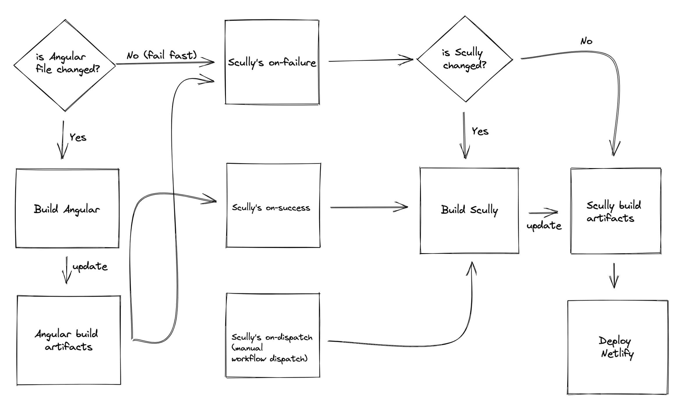

This is a repository for my personal blog which is written with the following technologies:

- [Angular](https://angular.io)
- [Scully](https://scully.io)
- [TailwindCSS](https://tailwindcss.com/)
- [Notion](https://notion.so)
- [Netlify](https://www.netlify.com/)

You can check out my blog live at [https://nartc.me](https://nartc.me)

## How it’s built

### Angular

As mentioned above, this blog is built using the Angular framework. I always keep this project up-to-date with the
latest version of Angular.

Code-style wise, I use Single File Component (aka `*.component.ts` files only) as much as possible. However, there are a
couple of components that have rather complex HTML/Styles that I choose to keep in separate files.

Shared components and feature components (routed) are built using Single-Component-as-Module (SCAM) approach. You’ll
find these components contain the components themselves as well as their modules.

Reactivity is achieved with `AsyncPipe` and `Observable`.

### TailwindCSS

This project uses TailwindCSS for stylings. Nothing too special here, I just like using TailwindCSS because it is easy
to use. I also keep TailwindCSS as up-to-date as possible.

### Scully

Scully is THE Static-site Generator for Angular ecosystem. It is easy to use and extensible. In fact, I build my
own [Scully Notion Plugin](https://github.com/nartc/notion-stuff/blob/main/libs/scully-plugin-notion/README.md) to
integrate Notion with Scully.

### Notion

All my blogs are written in Notion. There is a custom Scully plugin that will fetch (possible thanks to the
recent [Notion Developers API](https://developers.notion.com/)) the blog posts and generate the static site for them.

The experience is nice because I can write my blogs from any device and Grammarly can help with my English as well.

## CI / CD

CI/CD for this project is quite complex. At the highest level, there are three separate moving parts:

- Angular build
- Scully build
- Notion blogs

The relationship between these three are: Angular build + Notion blogs → Scully build → Deploy

To somewhat handle a sane amount of rebuild, I incorporate the following flow:



- Angular files list:

  ```
  package.json
  angular.json
  tailwind.config.js
  src/**/*.*
  ```

- Scully file: `scully.tnc-scully.config.ts`
